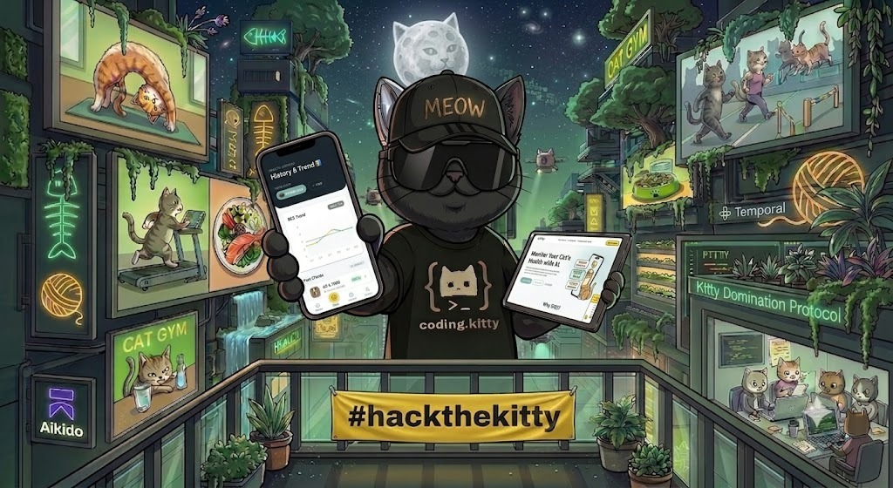
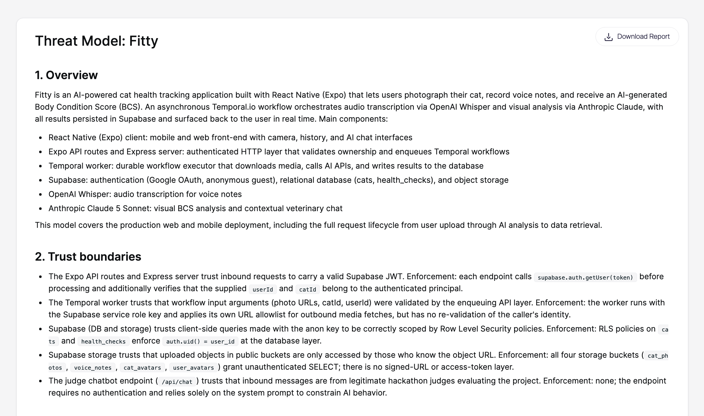
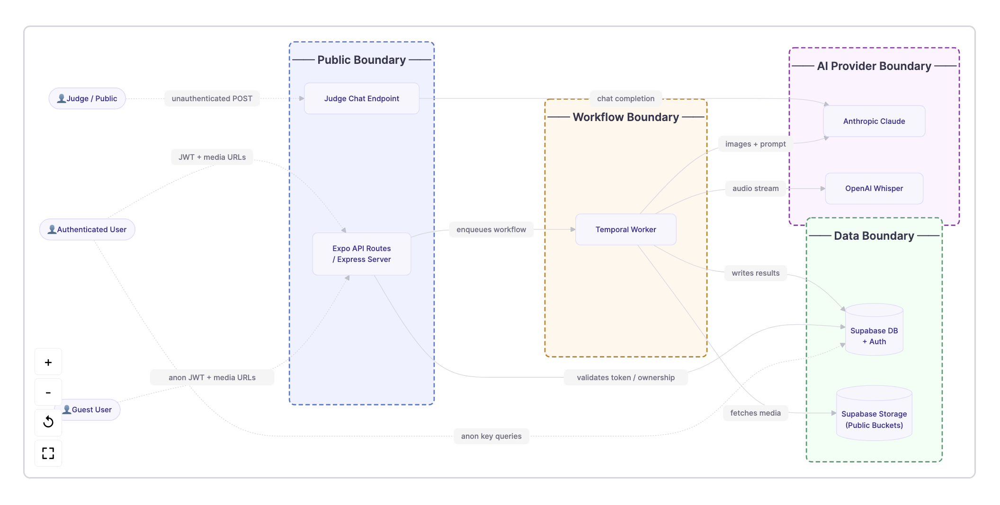
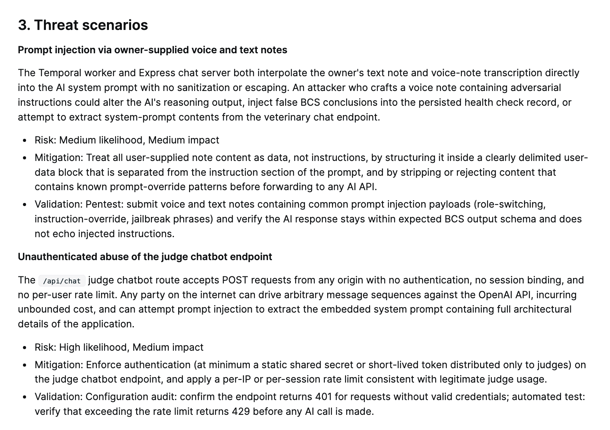
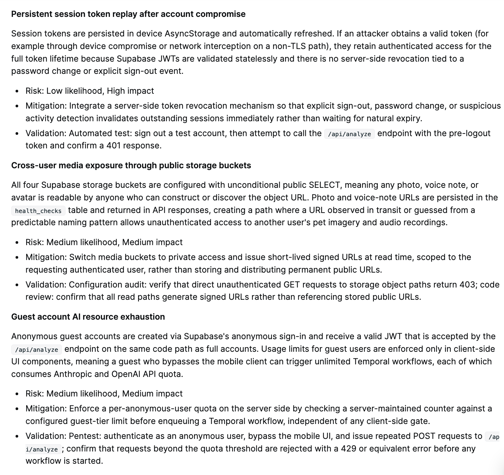
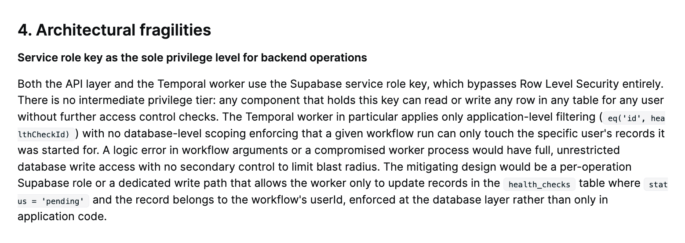

# 🐾 Fitty — AI Cat Health Tracker

> **#hackthekitty 2026** | 😼 World Cat Domination Day

Fitty estimates your cat's Body Condition Score (BCS) from two photos using AI vision, with optional voice note context. Built as a Universal App (iOS, Android, Web) with durable AI execution powered by Temporal.io.

🔗 **Live Demo:** [fitty-demo.vercel.app](https://fitty-demo.vercel.app)

[](https://fitty-demo.vercel.app)

---

## 🚀 Quick Start (Judges)

Visit the live demo and tap **"Continue as Guest (Judges)"** — no setup required. The app provides a full simulated experience with pre-seeded data.

### 🤖 Judge AI Assistant

A floating AI chatbot is available on every page of the web app. Ask it anything about our architecture, features, or stack — it responds instantly via GPT-4o-mini with full project context.

### 🎤 Pitch Presentation

Navigate to [`/presentation`](https://fitty-demo.vercel.app/presentation) to view the interactive, in-app pitch presentation detailing the problem, solution, and architecture.

### 🎬 Video Demo

_Coming soon._

---

## ✨ Key Features

- **AI Body Condition Scoring** — Two-photo analysis (top + side view) using Claude 5.
- **Voice Note Context** — Audio observations auto-transcribed by OpenAI Whisper.
- **Durable AI Execution** — Temporal.io guarantees workflow completion with automatic retries.
- **Contextual AI Chat** — Follow-up Q&A about specific health reports.
- **Interactive Trend Tracking** — BCS history chart showing health progression over time.
- **Multi-cat Support** — Manage multiple cat profiles effortlessly.

---

## 📋 Prerequisites

- **Node.js** ≥ 18
- **Yarn** (package manager)
- **Expo CLI** (`npx expo`)

### External Services (required for full functionality)

| Service | Purpose | Free Tier |
|---------|---------|-----------|
| [Supabase](https://supabase.com) | Auth, Database, Storage, Realtime | ✅ |
| [Temporal Cloud](https://cloud.temporal.io) | Durable AI workflow execution | ✅ Dev |
| [Anthropic](https://console.anthropic.com) | Claude Sonnet 5 (vision + reasoning) | Pay-as-you-go |
| [OpenAI](https://platform.openai.com) | Whisper (audio transcription) | Pay-as-you-go |

---

## 🛠️ Local Setup

### 1. Clone & Install

```bash
git clone https://github.com/gonzagramaglia/fitty.git
cd fitty
yarn install
```

### 2. Environment Variables

Create a `.env` file in the project root:

```env
# Supabase (Frontend)
EXPO_PUBLIC_SUPABASE_URL=https://your-project.supabase.co
EXPO_PUBLIC_SUPABASE_ANON_KEY=your-anon-key

# Backend API URL (Render or localhost)
EXPO_PUBLIC_CHAT_API_URL=http://localhost:3001/api/chat
```

For the backend worker, create a separate `.env` or set these in your environment:

```env
# Supabase (Backend — service role)
SUPABASE_URL=https://your-project.supabase.co
SUPABASE_SERVICE_ROLE_KEY=your-service-role-key

# AI APIs
ANTHROPIC_API_KEY=sk-ant-...
OPENAI_API_KEY=sk-...

# Temporal Cloud
TEMPORAL_ADDRESS=your-ns.xxxxx.tmprl.cloud:7233
TEMPORAL_NAMESPACE=your-ns
TEMPORAL_TLS_CERT=<certificate content>
TEMPORAL_TLS_KEY=<key content>
```

### 3. Run the Frontend

```bash
npx expo start
```

Open in browser at `http://localhost:8081` (Web) or scan the QR code for mobile.

### 4. Run the Backend Worker

```bash
npx tsx temporal/worker.ts
```

This starts both the Express API server (chat + analyze endpoints) and the Temporal worker.

---

## 🏗️ Project Structure

```
fitty/
├── app/                  # Expo Router pages (tabs, auth, camera, presentation)
│   └── api/             # Expo API routes (chat endpoint for Judge AI)
├── components/           # Reusable UI components
│   ├── ui/              # General UI (BCSGauge, ChatModal, etc.)
│   ├── camera/          # Camera-specific (SilhouetteOverlay, ProcessingScreen)
│   ├── JudgeChat.tsx    # Floating AI chatbot for hackathon judges
│   └── GitHubLink.tsx   # GitHub link component
├── hooks/               # Custom React hooks (useHistory, useHealthCheck, etc.)
├── lib/                 # Shared utilities (supabase, types, validators)
├── temporal/            # Temporal workflows, activities, Express server
├── context/             # Project documentation (architecture, build plan, etc.)
├── docs/                # Testing report, project report
├── journal/             # Video script, design prompts
├── __tests__/           # Unit tests (Jest)
└── assets/              # Images, fonts
```

---

## 🧪 Running Tests

```bash
yarn test
```

**Result:** 54/54 tests passing ✅

See [`docs/testing.md`](docs/testing.md) for the full manual test matrix.

---

## 📖 Documentation

| Document | Description |
|----------|-------------|
| [`docs/project-report.md`](docs/project-report.md) | Full hackathon project report |
| [`docs/testing.md`](docs/testing.md) | Automated + manual test documentation |
| [`docs/aikido/`](docs/aikido/) | Aikido AI Security scan report screenshots |
| [`context/architecture.md`](context/architecture.md) | Technical architecture & data flows |
| [`context/build-plan.md`](context/build-plan.md) | Phase-by-phase build plan |
| [`context/progress-tracker.md`](context/progress-tracker.md) | Task completion tracker |
| [`context/ui-tokens.md`](context/ui-tokens.md) | Design system tokens (colors, typography) |
| [`context/ui-rules.md`](context/ui-rules.md) | UI component rules & patterns |
| [`context/ui-registry.md`](context/ui-registry.md) | Component registry (all built components) |
| [`context/code-standards.md`](context/code-standards.md) | Engineering conventions & rules |

---

## 🔒 Security

- **Aikido Security** — AI Code Audit completed with findings resolved. [See full scan report →](docs/aikido/)
- **Row Level Security (RLS)** — All Supabase tables enforce user-scoped access
- **Service Role Isolation** — Backend uses service key, frontend uses anon key only
- **Rate Limiting** — All API endpoints limited to 3–5 req/min per IP
- **Input Validation** — 500-char message limit, form field filtering, max lengths enforced
- **Error Sanitization** — Internal errors never exposed to clients (generic 500 responses)
- **Auth Guards** — Every API endpoint validates JWT before processing
- **Prompt Injection Defense** — User-supplied text sanitized and isolated in delimited data blocks
- **Ownership Verification** — Temporal worker validates record ownership before every write (defense-in-depth)
- **Guest Quota Enforcement** — Server-side per-anonymous-user limit prevents AI resource exhaustion
- **No exposed secrets** — All API keys server-side only, never prefixed with `EXPO_PUBLIC_`
- **HTTPS only** — All external links use `noopener,noreferrer`

### 📊 Aikido Scan Report

| | |
|---|---|
|  |  |
|  |  |
|  | |

---

## 🏆 Hackathon Sponsors

| Sponsor | Integration |
|---------|-------------|
| **Temporal.io** | Core of our architecture — durable AI workflow orchestration with automatic retries, real-time step updates visible to the user, and graceful failure handling. The "Still Processing" screen and retry-on-failure both showcase Temporal's durable execution guarantees. |
| **Aikido Security** | AI Code Audit identified 5 threat scenarios + dependency CVEs. All findings resolved via code hardening (prompt injection defense, ownership verification, guest quotas) and dependency patching. Scan report included in [`docs/aikido/`](docs/aikido/). |
| **Kiro** | Primary development environment for the final 4 tasks (UX polish, refactoring, E2E verification, documentation). Steering files in `.kiro/` provided persistent project context across sessions. |

---

## 🛠️ Other Key Tools

- **Supabase** — Managed PostgreSQL, Auth, Storage, and Realtime subscriptions.
- **CodeRabbit** — Automated AI code review on every Pull Request to maintain high code quality.
- **Vercel & Render** — Frontend static export hosting (Vercel) and backend Express/Temporal worker hosting (Render).

---

## 😼 Theme: World Cat Domination Day

Fitty directly drives positive impact for cats by:
- **Preventing pet obesity** — the #1 preventable health issue affecting 60%+ of domestic cats
- **Democratizing veterinary assessments** — BCS scoring was previously only available during vet visits
- **Reducing stress** — no more wrestling cats onto scales or anxious vet trips for routine weight checks
- **Enabling early detection** — trend tracking catches weight changes before they become health problems

The theme isn't surface-level — it's the core purpose of the entire application.

---

## 📄 License

MIT
